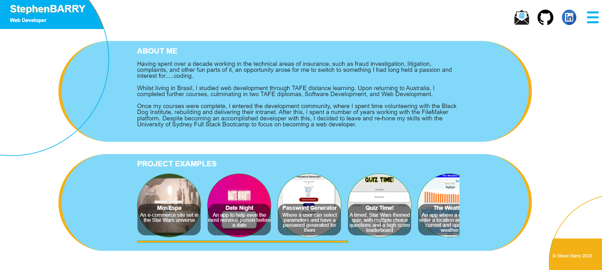

## Portfolio - Steve Barry

##  The Task

The task was to update our portfolio from Week 7 to include our latest group project, more recent examples, and a refreshed look, together with updated resume/LinkedIn/Github.

### ⭐ ⭐ S.T.A.R. ⭐ ⭐

**SITUATION**

No user story was provided, however the situation is to build a professional portfolio, demonstrating code examples, responsiveness, and design skills.

**TASK**

Provide a portfolio that shows our latest project, and our repos. It also should contain links to LinkedIn, Github, and our resume.

**ACTION**

Writing of a solution to resolve the situation, including:
* Layout
  * *Layout is responsive and functional on various screen sizes*
  * *Polished and attractive design*
  * *Logical layout*
  * *Improved code visualisation - eg: indentation*
  * *Error free loading*
  * *Favicon designed and added*
  * *Thorough comments*
  * *Intuitive design*
* Javascript
  * *Error free performance*
  * *Multiple functions to separate aspects of code*
  * *Thorough comments*
* Employer Ready
  * *Updated and streamlined resume*
  * *LinkedIn updated*
  * *Github pins updated* 
* GIT
  * *Numerous commits to track changes in code*
  * *Code added to public repository and Github Pages for public viewing*
* Functionality
  * *Users are presented with a responsive list of projects and repos*
  * *Users can preview an application by clicking on an image,this will bring up a modal screen with a preview of the page, together with links to the deployed application and the repo*
  * *Multiple ways to contact me, including a downloadable resume and a link to an online copy*

**RESULT**

The end code is stored on Github, and publicly available and viewable. This result meets all requirements set out.

##  The Outcome

As all items stipulated in the assignment document are completed, the task is now complete. 

> There is a new Google feature named FLoc that is generating the below error. This is not a result of the performance or design of the site.
> 
> 
> 
> [Google FLoC](https://techcrunch.com/2021/03/30/google-starts-trialling-its-floc-cookie-alternative-in-chrome/)

You can view the finished product [HERE](https://nbs5000.github.io/portfolio3/)

You can also watch a demo video [HERE](https://drive.google.com/file/d/1vq2pE9ad7Zu77d9ks4apfFt8DBy_qU_L/view?usp=sharing)

Alternatively, here is a screenshot:

> 

---

Written by Steve Barry - Due date 28/3/2022

© 2022 Trilogy Education Services, LLC, a 2U, Inc. brand. Confidential and Proprietary. All Rights Reserved.

